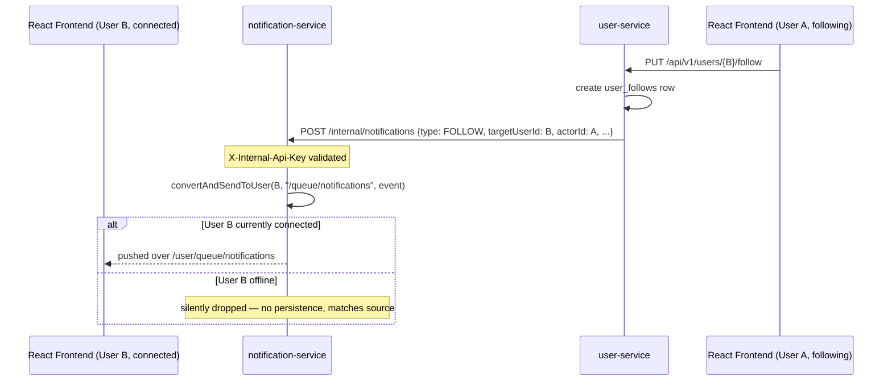

# notification-service

Real-time, **non-persisted** delivery of follow/like/comment/reply notifications. This is the parity default for Decisions #1/#2 in `docs/decisions/DECISIONS_REQUIRED.md`: the Node source delivered these over Socket.IO to online users only, with no database table behind it — this service does the same thing with Spring's STOMP/WebSocket support. Persistence (a notifications inbox) is a separate, explicitly-requested future improvement, not built here.

No database. No Flyway. The only state is in-memory WebSocket sessions.

## Run locally

```bash
docker compose up discovery-service notification-service
```
- WebSocket endpoint: `ws://localhost:8083/ws` (SockJS fallback enabled) — normally reached via the gateway at `ws://localhost:8080/ws/**`
- Internal publish endpoint (service-to-service only): `POST http://localhost:8083/internal/notifications`
- Swagger UI: `http://localhost:8083/swagger-ui.html` (documents the one internal HTTP endpoint only — the WS contract is below, Swagger doesn't cover STOMP)
- Health: `http://localhost:8083/actuator/health`

## Client contract (frontend integration)

The frontend connects once per session:

```js
const socket = new SockJS(`${GATEWAY_URL}/ws`);
const client = Stomp.over(socket);
client.connect(
  { Authorization: `Bearer ${jwt}` },   // STOMP CONNECT header, not a query param
  () => {
    client.subscribe('/user/queue/notifications', (message) => {
      const event = JSON.parse(message.body);
      // event: { type, targetUserId, actorId, actorName, actorProfilePicture, postId, commentId, occurredAt }
    });
  }
);
```

A missing/invalid/expired token rejects the CONNECT outright — there is no anonymous notification stream.

## Internal publish contract (called by user-service / post-service via Feign)

```
POST /internal/notifications
X-Internal-Api-Key: <shared secret>
Content-Type: application/json

{
  "type": "FOLLOW" | "LIKE" | "COMMENT" | "REPLY",
  "targetUserId": 123,
  "actorId": 456,
  "actorName": "someone",
  "actorProfilePicture": "https://...",
  "postId": null,
  "commentId": null,
  "occurredAt": "2026-08-23T12:00:00Z"
}
```

Delivery is best-effort: if the target user isn't currently connected, the event is silently dropped (matches source behavior exactly — see `NotificationDeliveryService` javadoc).

## Flow: follow -> real-time notification



## Known limitations

- **Single-instance only.** The in-memory STOMP broker doesn't relay across multiple running instances of this service — a user connected to instance A won't see an event published while their session is on instance A but the publish request lands on instance B behind a load balancer. Matches the source's single-Node-process limitation. Scaling this needs an external STOMP relay (e.g. RabbitMQ), tracked in `docs/improvements/RECOMMENDED_IMPROVEMENTS.md`.
- No notification history/inbox — by design (parity default). Revisit only on your explicit request.
- Publish calls from `user-service`/`post-service` are best-effort (circuit breaker + fallback that logs and swallows) — a `notification-service` outage never fails the underlying follow/like/comment/reply request.
