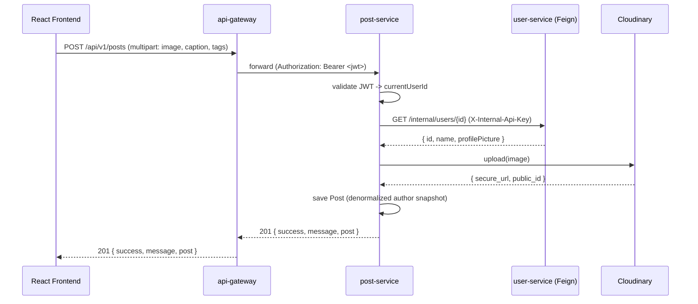
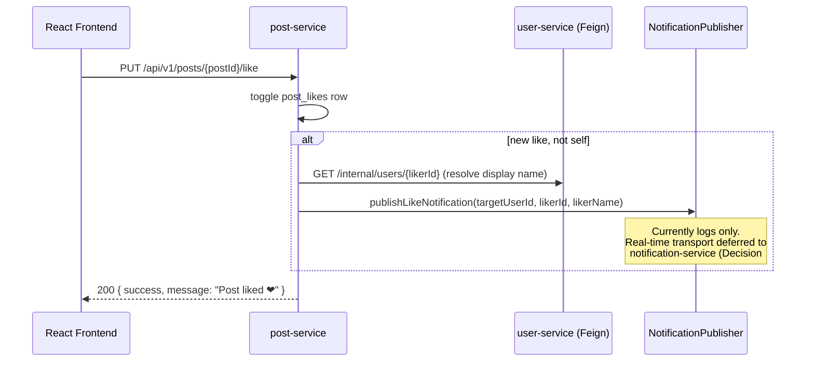

# post-service

Posts, feed, likes, saved posts, and threaded comments for the Sphere platform. Ports `server/src/controllers/feed/{post,comment}.controller.js` from the Node source — see `/docs/01-existing-system-analysis.md` and `/docs/api/API_INVENTORY.md` in the migration-docs package for the full source-of-truth trace.

## Run locally

```bash
# From the sphere-backend root, with a root .env containing JWT_SECRET / INTERNAL_API_SECRET
# (must match user-service's values exactly)
docker compose up postgres-posts discovery-service user-service post-service
```

Or standalone: `mvn spring-boot:run` with `post-service/.env` loaded (or exported) and `discovery-service` + `user-service` already running.

- API base: `http://localhost:8082/api/v1/posts`
- Swagger UI: `http://localhost:8082/swagger-ui.html`
- OpenAPI JSON: `http://localhost:8082/v3/api-docs`
- Health: `http://localhost:8082/actuator/health`

## API reference

| Method | Path | Auth | Notes |
|---|---|---|---|
| GET | `/api/v1/posts` | Required | Global feed, paginated, excludes blocked authors |
| GET | `/api/v1/posts/following` | Required | Scope = following ∪ self |
| GET | `/api/v1/posts/saved` | Required | Not paginated (parity with source) |
| GET | `/api/v1/posts/me` | Required | Response double-nested under `data` (parity — Decision #8) |
| GET | `/api/v1/posts/{postId}` | **Public** | Optional auth — includes `isSaved` if a valid token is present |
| POST | `/api/v1/posts` | Required | Multipart, field `image` |
| POST | `/api/v1/posts/thought` | Required | JSON body |
| PUT | `/api/v1/posts/{postId}` | Required (author-only) | Multipart, optional `image`; rejects thought-type posts |
| PUT | `/api/v1/posts/{postId}/like` | Required | Toggle |
| PUT | `/api/v1/posts/{postId}/save` | Required | Toggle |
| DELETE | `/api/v1/posts/{postId}` | Required (author-only) | Comments cascade via DB FK |
| GET | `/api/v1/posts/{postId}/comments` | **Public** | Nested reply tree |
| POST | `/api/v1/posts/{postId}/comments` | Required | Top-level or reply (`parentId`) |
| DELETE | `/api/v1/posts/{postId}/comments/{commentId}` | Required (author-only) | **403** not 400 (fixed — Decision #7); reply subtree cascades via DB FK |

Full request/response shapes: Swagger UI, or `/docs/api/API_INVENTORY.md`.

## Inter-service dependency

Calls `user-service`'s internal API via Feign (`UserServiceClient`) for:
- author display snapshot (name/profile picture) at post/comment creation time — denormalized onto the row, not re-fetched on every read
- the "following" feed's scope (`GET /internal/users/{id}/following-ids`)
- blocked-user exclusion on any feed (`GET /internal/users/{id}/blocked-ids`)

These calls go to `USER-SERVICE` resolved via Eureka, authenticated with a shared `X-Internal-Api-Key` header (`INTERNAL_API_SECRET`), not the end user's JWT.

## Flow: creating a media post



## Flow: like -> notification (deferred transport)



## Known limitations (see `docs/acceptance/04-post-service.md` for the full list)

- Comment tree building is O(n²) over the flat comment list per post (parity with source's approach; flagged for `RECOMMENDED_IMPROVEMENTS.md`).
- `NotificationPublisher` only logs — no real-time delivery yet.
- Feign calls to `user-service` degrade to "empty list" / 404 on failure rather than retrying — acceptable for a first cut, not resilient to `user-service` being down (no circuit breaker yet).
